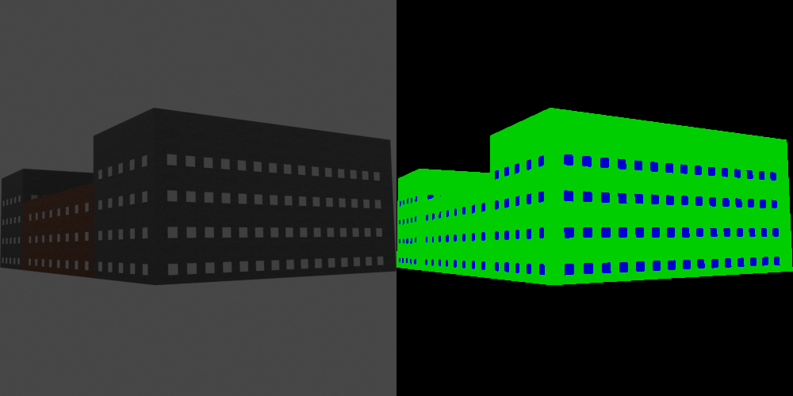
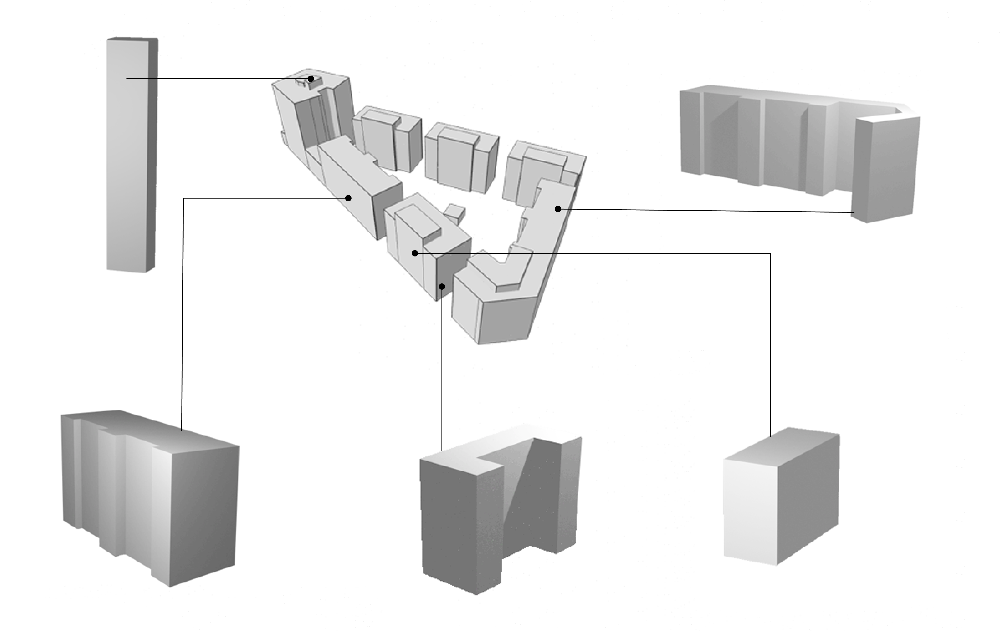

# Synthetic Dataset Generator



This is a tool that generates a dataset of synthetic buildings of different typologies. The generated data includes:

* Mesh files of generated buildings, ```.obj``` format
* Rendered images of the mesh, ```.png``` format
* Rendered segmentation masks, ```.png``` format
* Point cloud files, ```.ply``` format (the number of points by default is 2048, can be changed in ```dataset_config.py```)

## How To Use

* Install [Blender](https://www.blender.org/download/)>=2.90. After installation make sure to add blender as an Environment variable. 
* Download the package as a .zip file or:
```
git clone https://github.com/CDInstitute/CompoNET
```
*Navigate to the ```dataset``` folder.

## Synthetic Buildings

To create completely synthetic buildings use:

```
blender setup.blend --python dataset.py
```
Unfortunately, it is not possible to use Blender in background mode as it will not render the image masks.

Note:
all the parameters related to the dataset (including any specific parameters for your buildings (e.g. max and min height / width / length)) are to be provided in ```dataset_config.py```. Default values adhere to international standards (min) and most common European values (max):

* minimum height 3m
* minimum length and width 6m
* maximum length, width, height 30 m
Other values to set:
* number of dataset samples
* rendered image dimensions
* number of points in the point clouds
* paths to store the generated data

### Annotation structure

{'img': 'images/0.png',
 'category': 'building',
'img_size': (256, 256),
'2d_keypoints': [],
'mask': 'masks/0.png',
 'img_source': 'synthetic',
 'model':  'models/0.obj',
 'point_cloud': 'PointCloud/0.ply',
 'model_source': 'synthetic',
 'trans_mat': 0,
 'focal_length': 35.0,
 'cam_position': (0.0, 0.0, 0.0),
 'inplane_rotation': 0,
 'truncated': False,
 'occluded': False,
 'slightly_occluded': False,
 'bbox': [0.0, 0.0, 0.0, 0.0],
 'material': ['concrete', 'brick']}

## Buildings from the existing .shp files:



Use provided .gltf (or your own) to create separate .obj files for each building in .gltf:
```
blender --background setup.blend --python shp2obj.py your_file.gltf
```
For now there is a manual process to convert shapefiles to .gltf format due to inaccuracies in Qgis2threejs library (will be fixed later):
* Load your .shp file into [QGis](https://www.qgis.org/en/site/)
* Indicate your height field as a z-dimension in ```Properties -> ```
* [Install](https://qgis2threejs.readthedocs.io/en/docs/Tutorial.html#install-the-plugin) Qgis2threejs plugin if you do not have it yet
* Select the buildings that interest you, make sure not to choose too many, as you might not have enough RAM
* ```Web -> Qgis2threejs -> choose your layer```
* ```Right click on the layer -> Properties -> height -> choose your height field```
* ```File -> Save Scene As -> .gltf```
