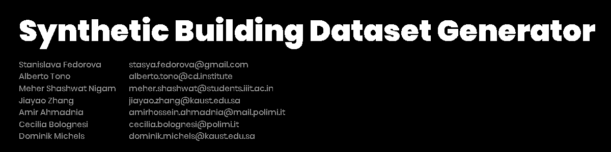
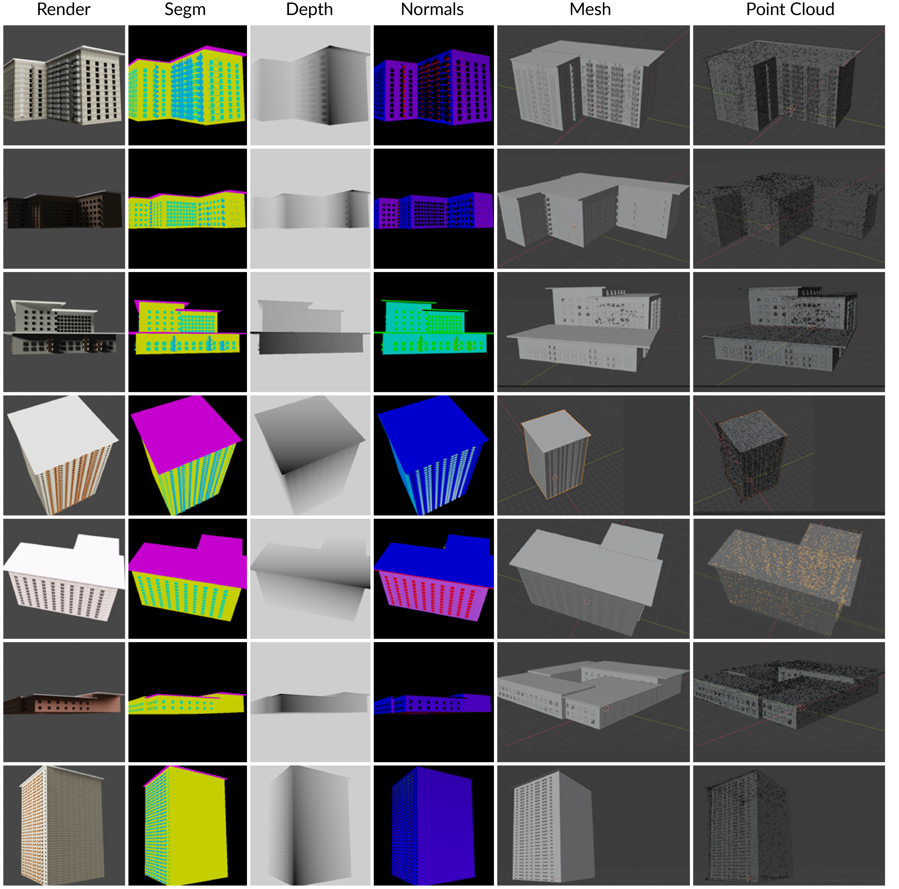

# Synthetic Dataset Generator
#### Authors: [Stanislava Fedorova](https://www.linkedin.com/in/stanislava-fedorova/), [Alberto Tono](https://www.linkedin.com/in/albertotono3/), [Meher Shashwat Nigam](https://www.linkedin.com/in/mehershashwatnigam/), [Jiayao Zhang](https://www.linkedin.com/in/jiayao-zhang-773045159/), [Amirhossein Ahmadnia](https://www.linkedin.com/in/amirhossein-ahmadnia-4b4bb117b/), [Cecilia bolognesi](https://www.linkedin.com/in/cecilia-bolognesi-99914283/), [Dominik L. Michels](https://www.linkedin.com/in/dominik-l-michels/)


This is a tool that generates a dataset of synthetic buildings of different typologies. 

[Arxiv](https://arxiv.org/pdf/2104.12564v1.pdf) [Website](https://cdinstitute.github.io/Building-Dataset-Generator/) [Samples](https://drive.google.com/drive/folders/1_D9nuNd9VXjzdqMoKIqrET7yiq21uZv6?usp=sharing)

The generated data includes:

* Mesh files of generated buildings, ```.obj``` format
* Rendered images of the mesh, ```.png``` format
* Rendered segmentation masks, ```.png``` format
* Depth annotation, ```.png``` and  ```.exr``` format
* Surface normals annotation, ```.png``` format
* Point cloud files, ```.ply``` format (the number of points by default is 2048, can be changed in ```dataset_config.py```)

## How To Use

* Install [Blender](https://www.blender.org/download/)>=2.90. After installation make sure to add blender as an Environment variable. 
* Download the package as a .zip file or:
```
git clone https://github.com/CDInstitute/CompoNET
```
*Navigate to the ```Building-Dataset-Generator``` folder.
```
pip install -r requirements.txt
```

To create completely synthetic buildings use:

```
run.bat
```

Or:

```
blender setup.blend --python dataset.py
```

Unfortunately, it is not possible to use Blender in background mode as it will not render the image masks correctly.

Note:
all the parameters related to the dataset (including any specific parameters for your buildings (e.g. max and min height / width / length)) are to be provided in ```dataset_config.py```. Default values adhere to international standards (min) and most common European values (max):

* minimum height 3m
* minimum length and width 6m
* maximum length, width, height 30 m
Other values to set:
* number of dataset samples
* building types
* component materials
* rendered image dimensions
* number of points in the point clouds
* paths to store the generated data
* option to save the .exr files

### Annotation structure

{'img': 'images/0.png',
 'category': 'building',
'img_size': (256, 256),
'2d_keypoints': [],
'mask': 'masks/0.png',
 'img_source': 'synthetic',
 'model':  'models/0.obj',
 'point_cloud': 'PointCloud/0.ply',
 'model_source': 'synthetic',
 'trans_mat': 0,
 'focal_length': 35.0,
 'cam_position': (0.0, 0.0, 0.0),
 'inplane_rotation': 0,
 'truncated': False,
 'occluded': False,
 'slightly_occluded': False,
 'bbox': [0.0, 0.0, 0.0, 0.0],
 'material': ['concrete', 'brick']}

## Performance

We ran the dataset generation algorithm with different input parameters on Windows 10 OS on CPU and GPU using AMD Ryzen 7 3800-X 8-Core Processor and GeForce GTX 1080.
Here we report the results for the multiview generation (3 views per model):

| GPU | Multiview | Time (h) |
| ------------- | ------------- | ------------- |
|   |   |  1.7 |
|   | :white_check_mark:  |  2.7 |
|  :white_check_mark:  |  | 0.34  |
|  :white_check_mark:  | :white_check_mark: | 0.8  |


## Generated Image Samples


